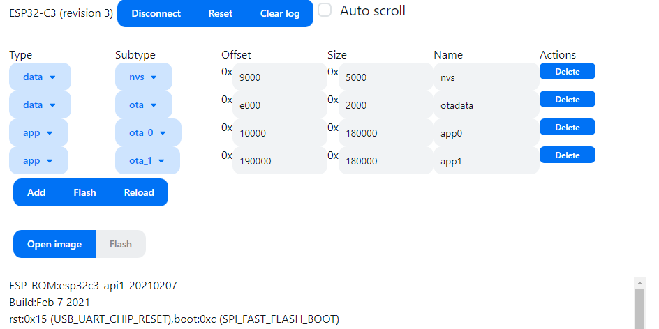

# Web ESP32 Writer

Flash image/partition and monitor serial output for ESP32 on web.

https://mtsmfm.github.io/web-esp32-writer



## Development

Run the development server:

```bash
npm run dev
```
